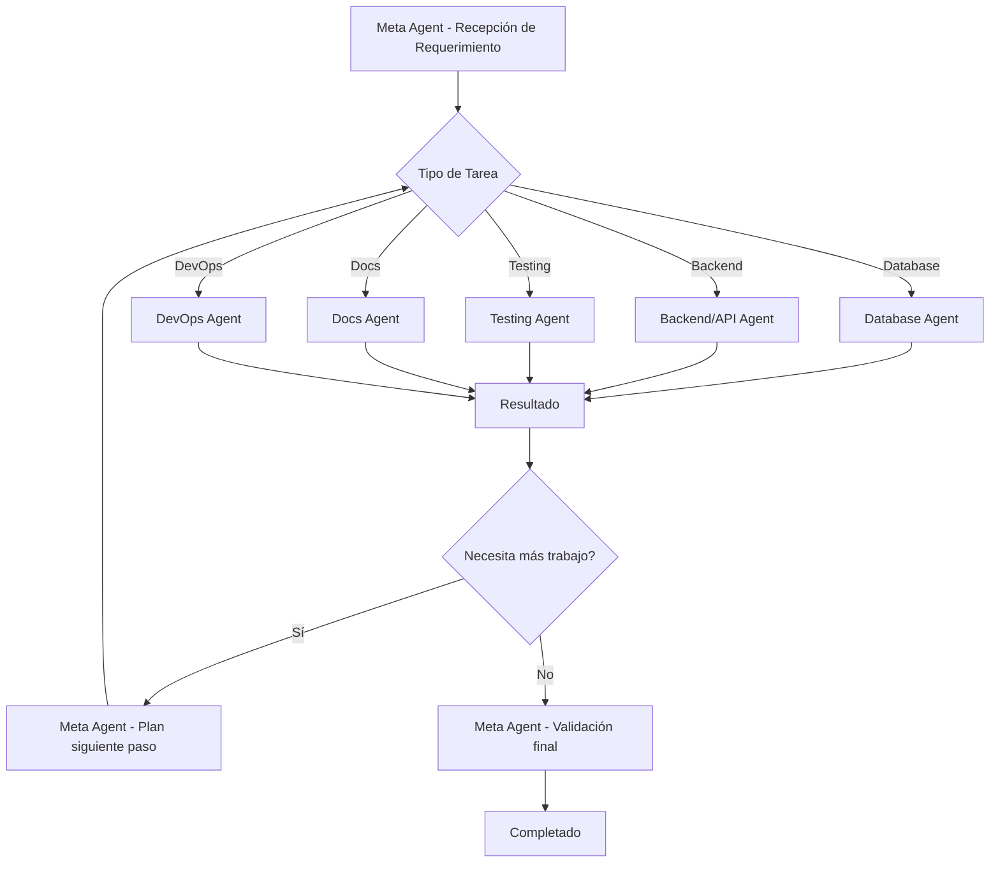

# Sistema de Agentes - Restaurants-e4

## Arquitectura de Agentes

```
┌─────────────────────────────────────────────────────────────────────┐
│                        META AGENT (Orchestrator)                    │
│                   restaurants-development-meta                       │
│  Coordina, planifica, y delega tareas a subagentes especializados   │
└─────────────────────────────────────────────────────────────────────┘
                              │
        ┌──────────────────────┼──────────────────────┐
        │                      │                      │
        ▼                      ▼                      ▼
┌──────────────┐    ┌──────────────┐    ┌──────────────┐
│   Database   │    │  Backend/API │    │   Testing    │
│    Agent     │    │    Agent     │    │    Agent     │
└──────────────┘    └──────────────┘    └──────────────┘
        │                      │                      │
        └──────────────────────┼──────────────────────┘
                               │
        ┌──────────────────────┼──────────────────────┐
        │                      │                      │
        ▼                      ▼                      ▼
┌──────────────┐    ┌──────────────┐    ┌──────────────┐
│   Frontend   │    │  Docs &     │    │  DevOps &    │
│    Agent     │    │  Swagger     │    │    CI/CD     │
│  (Opcional) │    │    Agent     │    │    Agent     │
└──────────────┘    └──────────────┘    └──────────────┘
```

---

## META AGENTE: restaurants-development-meta

### Descripción
Agente orquestador principal que coordina el desarrollo completo del proyecto de backend de restaurantes. Gestiona el flujo de trabajo, delega tareas a subagentes especializados, monitorea el progreso y asegura la calidad general del proyecto.

### Responsabilidades Principales
- Planificación y desglose de tareas (WBS)
- Coordinación entre subagentes
- Validación de requisitos y scope
- Gestión de dependencias entre módulos
- Monitoreo de progreso y hitos
- Gestión de riesgos y bloqueos
- Asegurar consistencia arquitectónica
- Gestión de código y merges

### Herramientas Disponibles
```yaml
agent:
  description: Lanzar subagentes especializados
  parameters:
    - subagent_type: Tipo de subagente a invocar
    - prompt: Instrucciones específicas para el subagente

read:
  description: Leer archivos del proyecto
 适用于: Todos los archivos de configuración, código, documentación

write:
  description: Escribir/crear archivos
  适用于: Configuraciones, código, documentación

edit:
  description: Editar archivos existentes
  适用于: Modificaciones incrementales de código

glob:
  description: Buscar archivos por patrón
  适用于: Encontrar módulos, configuraciones, tests

grep:
  description: Buscar contenido en archivos
  适用于: Encontrar referencias, dependencias, patrones

bash:
  description: Ejecutar comandos de terminal
  适用于: npm, git, comandos de sistema
```

### MCP Servers
```yaml
mcp-supabase:
  - Database schema management
  - Queries directas a base de datos
  - Migraciones

mcp-filesystem:
  - Lectura/escritura de archivos
  - Navegación de directorios
  - Operaciones de archivo

mcp-git:
  - Historial de commits
  - Status del repositorio
  - Ramas y merges

mcp-postman:
  - Gestión de colecciones
  - Importación/Exportación
  - Ejecución de tests
```

### Habilidades (Skills)
```yaml
project-planning:
  - Creación de roadmap
  - Definición de milestones
  - Estimación de tiempo
  - Gestión de recursos

code-review:
  - Revisión de pull requests
  - Análisis de calidad de código
  - Detección de code smells
  - Validación de patrones

dependency-management:
  - Gestión de paquetes npm
  - Análisis de vulnerabilidades
  - Actualización de dependencias
  - Resolución de conflictos

quality-gates:
  - Definición de criterios de aceptación
  - Validación de tests
  - Validación de documentación
  - Validación de linters
```

### Capacidades
- **Coordinación**: Puede lanzar hasta 5 subagentes en paralelo
- **Contexto**: Mantiene contexto de 200K+ tokens para el proyecto completo
- **Persistencia**: Guarda progreso y estado en memoria del proyecto
- **Error Handling**: Recupera de fallos de subagentes automáticamente
- **Priorización**: Ordena tareas por dependencias y criticidad

### Limitaciones
- No puede ejecutar código directamente (debe delegar a subagentes)
- Tiempo máximo de tarea: 10 minutos (con posibilidad de extender)
- No puede acceder a sistemas externos sin autorización
- Dependencia de subagentes para ejecución técnica

### Riesgos y Mitigación

| Riesgo | Probabilidad | Impacto | Mitigación |
|--------|-------------|----------|------------|
| Subagente falla en tarea crítica | Media | Alta | Retry automático, fallback a agentes alternativos |
| Dependencia circular entre módulos | Baja | Media | Análisis de dependencias antes de delegar |
 Pérdida de contexto entre sesiones | Media | Media | Persistencia de memoria, snapshots del proyecto |
| Conflictos de merge en código | Media | Alta | Estrategia de branching clara, revisión sistemática |
| Agotamiento de tokens de contexto | Baja | Media | Compresión de contexto, archivos de resumen |

### Protocolos de Comunicación

#### Con Subagentes
```yaml
invocacion:
  formato: |
    <agent_request>
    <role>{rol_del_subagente}</role>
    <context>
    - Proyecto: Restaurants-e4
    - Fase actual: {fase}
    - Contexto relevante: {contexto}
    </context>
    <task>
    - Objetivo: {objetivo_específico}
    - Restricciones: {restricciones}
    - Dependencias: {dependencias}
    - Criterios de aceptación: {criterios}
    </task>
    <output>
    - Formato esperado: {formato}
    - Archivos a modificar: {archivos}
    - Comunicar a: {otros_agentes}
    </output>
    </agent_request>

respuesta:
  formato: |
    <agent_response>
    <status>{COMPLETED | PARTIAL | FAILED | BLOCKED}</status>
    <summary>{resumen_educativo}</summary>
    <changes>
    - Archivos modificados: {lista}
    - Archivos creados: {lista}
    - Archivos eliminados: {lista}
    </changes>
    <dependencies>
    - Nuevas dependencias: {lista}
    - Breaking changes: {lista}
    </dependencies>
    <next_steps>
    - Siguiente agente: {agente}
    - Tarea: {tarea}
    </next_steps>
    <blockers>
    - Bloqueos: {lista}
    - Requiere intervención: {tipo}
    </blockers>
    </agent_response>
```

#### Con Usuario
```yaml
progreso:
  formato: |
    ## Progreso del Proyecto

    ### Módulo Actual: {nombre}
    Estado: {estado} | Progreso: {porcentaje}%

    ### Tareas Completadas
    - [x] {tarea}
    - [x] {tarea}

    ### En Progreso
    - [ ] {tarea} ({subagente_asignado})

    ### Pendientes
    - [ ] {tarea}

    ### Bloqueos
    {bloqueos_identificados}

    ### Siguiente Pasos
    1. {paso}
    2. {paso}

decision_required:
  formato: |
    ## Se requiere decisión del usuario

    ### Opción A: {opcion}
    Ventajas: {ventajas}
    Riesgos: {riesgos}

    ### Opción B: {opcion}
    Ventajas: {ventajas}
    Riesgos: {riegos}

    Recomendación: {recomendación}
```

---

## SUBAGENTE 1: Database Agent

### Descripción
Agente especializado en operaciones de base de datos usando Prisma ORM y Supabase. Gestiona schema, migraciones, seeds, y optimización de consultas.

### Responsabilidades
- Diseño y evolución del schema Prisma
- Creación y ejecución de migraciones
- Seed de datos de prueba
- Optimización de consultas y análisis de performance
- Gestión de índices y restricciones
- Relaciones y referencias
- Transacciones y locks

### Herramientas MCP
```yaml
mcp-supabase:
  - supabase.db.query: Ejecutar consultas SQL
  - supabase.db.schema: Obtener schema actual
  - supabase.db.migrate: Crear/aplicar migraciones
  - supabase.db.reset: Resetear base de datos
  - supabase.db.backup: Crear backups
  - supabase.db.restore: Restaurar backups

prisma-cli:
  - prisma migrate dev: Desarrollo local
  - prisma migrate deploy: Producción
  - prisma db push: Sincronizar sin migración
  - prisma studio: UI de exploración
  - prisma format: Formatear schema
  - prisma validate: Validar schema
```

### Capacidades Técnicas
```yaml
schema_design:
  - Modelos Prisma
  - Enumeraciones
  - Relaciones (1:1, 1:N, N:N)
  - Índices compuestos
  - Constraints únicos

migration_strategy:
  - Migraciones versionadas
  - Rollbacks seguros
  - Data migrations
  - Schema drifts

query_optimization:
  - Análisis de explain plans
  - Uso eficiente de índices
  - N+1 problem prevention
  - Pagination patterns
  - Select/include optimization
```

### Limitaciones
```yaml
no_direct_sql:
  - Todas las operaciones vía Prisma
  - No raw SQL excepto casos excepcionales

no_prod_access:
  - Solo staging/dev directo
  - Producción vía migraciones aprobadas

no_schema_lock:
  - Cambios de schema requieren aprobación
  - Breaking changes need review
```

### Riesgos Específicos

| Riesgo | Probabilidad | Impacto | Mitigación |
|--------|-------------|----------|------------|
| Data loss en migración | Baja | Crítica | Backups automáticos, staging primero |
| Schema drift | Media | Alta | Detección automatizada, CI gates |
| N+1 queries | Alta | Media | Linter de Prisma, análisis de logs |
| Lock contention | Baja | Media | Timeout configuration, retry logic |
| Index bloat | Media | Media | Reindex scheduling, monitoring |

### Protocolos

#### Solicitud de Schema Change
```yaml
input:
  modelo: {nombre}
  cambios:
    - tipo: {ADD_FIELD | REMOVE_FIELD | MODIFY_FIELD | ADD_RELATION}
      campo: {nombre}
      tipo: {tipo_prisma}
      nullable: {boolean}

proceso:
  1. Validar impacto en queries existentes
  2. Crear migration en rama feature
  3. Ejecutar en staging
  4. Validar datos existentes
  5. Solicitar aprobación para prod

output:
  migration_file: {path}
  diff: {schema_diff}
  affected_tables: {lista}
  requires_data_migration: {boolean}
```

---

## SUBAGENTE 2: Backend/API Agent

### Descripción
Agente especializado en desarrollo backend con NestJS. Crea controladores, servicios, DTOs, guards, interceptores y pipes.

### Responsabilidades
- Implementación de endpoints REST
- Lógica de negocio en servicios
- Validación con DTOs
- Autenticación y autorización
- Manejo de errores global
- Logging y monitoring
- Cache con Redis
- Rate limiting

### Herramientas
```yaml
nest-cli:
  - nest g module: Crear módulo
  - nest g controller: Crear controlador
  - nest g service: Crear servicio
  - nest g dto: Crear DTO
  - nest g guard: Crear guard
  - nest g interceptor: Crear interceptor
  - nest g pipe: Crear pipe
  - nest build: Compilar para producción

eslint_prettier:
  - Validación de código
  - Formateo consistente

swaggers:
  - Documentación automática
  - Validación de contratos
```

### Capacidades Técnicas
```yaml
controller_patterns:
  - RESTful conventions
  - Status codes correctos
  - Response DTOs
  - Pagination params
  - Filtering and sorting

service_layer:
  - Business logic separation
  - Dependency injection
  - Async/await patterns
  - Error handling

validation:
  - class-validator decorators
  - class-transformer
  - Custom validators
  - Error messages i18n

auth_authorization:
  - JWT strategies
  - Role-based guards
  - Custom decorators
  - Permission checks
```

### Limitaciones
```yaml
no_frontend_logic:
  - Solo API layer
  - No renderizado ni UI

no_direct_db:
  - Via PrismaService
  - No bypass ORM

no_secrets:
  - Variables de entorno
  - No hardcoded secrets
```

### Riesgos Específicos

| Riesgo | Probabilidad | Impacto | Mitigación |
|--------|-------------|----------|------------|
| Breaking API changes | Media | Alta | Versionado, deprecation warnings |
| SQL injection | Baja | Crítica | Siempre Prisma parameterized |
| Auth bypass | Baja | Crítica | Test de seguridad, code review |
| Performance degradation | Media | Media | Profiling, load testing |
| Memory leaks | Baja | Alta | Monitoring, pattern checks |

---

## SUBAGENTE 3: Testing Agent

### Descripción
Agente especializado en pruebas automatizadas: unitarias, de integración y E2E. Gestiona suites de tests, coverage y CI.

### Responsabilidades
- Tests unitarios (Jest)
- Tests de integración
- Tests E2E (Supertest)
- Mocking y stubbing
- Test fixtures
- Coverage reports
- Test data factories
- Flaky test detection

### Herramientas
```yaml
jest:
  - Test suites
  - Matchers customizados
  - Mock functions
  - Test each/all

supertest:
  - HTTP assertions
  - Request/response testing

coverage_tools:
  - c8/istanbul
  - Reportes HTML/LCOV

test_helpers:
  - prisma-seed
  - test-containers
  - factory-bot patterns
```

### Capacidades Técnicas
```yaml
unit_testing:
  - Pure functions
  - Service logic
  - Utility functions
  - Mock dependencies

e2e_testing:
  - Full request/response
  - Database integration
  - Auth flows
  - Error scenarios

testing_patterns:
  - AAA (Arrange-Act-Assert)
  - Given-When-Then
  - Test doubles
  - Test isolation
```

### Limitaciones
```yaml
no_manual_testing:
  - Solo automatizado
  - UI testing requeriría herramientas extras

no_prod_testing:
  - Solo staging/dev
  - No data production real
```

### Riesgos Específicos

| Riesgo | Probabilidad | Impacto | Mitigación |
|--------|-------------|----------|------------|
| Flaky tests | Media | Alta | Deterministic fixtures, retries |
| Low coverage | Media | Media | Coverage gates, reports |
| Slow tests | Alta | Media | Parallel execution, mocking |
| Test pollution | Media | Alta | Isolation, cleanup |
| False positives | Baja | Media | Clear assertions, snapshots |

---

## SUBAGENTE 4: Documentation & Swagger Agent

### Descripción
Agente especializado en documentación técnica, Swagger/OpenAPI, y generación de contratos de API.

### Responsabilidades
- Decoradores Swagger
- Documentación de endpoints
- Ejemplos de request/response
- OpenAPI specification
- API reference docs
- CHANGELOG
- Contributing guidelines
- Architecture decision records (ADRs)

### Herramientas
```yaml
nestjs_swagger:
  - @ApiTags
  - @ApiOperation
  - @ApiResponse
  - @ApiBody
  - @ApiParam
  - @ApiQuery
  - @ApiBearerAuth

docs_generators:
  - TypeDoc (para comentarios TypeScript)
  - Swagger UI (interactivo)
  - Redoc (alternativa)
```

### Capacidades Técnicas
```yaml
swagger_decorators:
  - Tagged endpoints
  - Response schemas
  - Error responses
  - Authentication docs

api_contracts:
  - Request examples
  - Response examples
  - Enum documentation
  - Pagination docs

documentation:
  - README actualizado
  - SETUP instructions
  - API reference
  - ADR format
```

### Limitaciones
```yaml
no_user_guides:
  - Solo documentación técnica
  - No manuales de usuario

no_video:
  - Texto y diagramas
  - No screencasts
```

---

## SUBAGENTE 5: DevOps & CI/CD Agent

### Descripción
Agente especializado en configuración de CI/CD, despliegues, monitoreo y seguridad DevOps.

### Responsabilidades
- Configuración GitHub Actions
- Docker containers
- Docker Compose
- CI pipelines
- Deployment scripts
- Environment management
- Security scanning
- Monitoring setup
- Error tracking (Sentry)

### Herramientas
```yaml
github_actions:
  - workflows yml
  - secrets management
  - cache strategies
  - parallel jobs

docker:
  - Dockerfile
  - docker-compose
  - multi-stage builds
  - optimization

security:
  - npm audit
  - Snyk
  - CodeQL
  - Dependabot
```

### Capacidades Técnicas
```yaml
ci_pipeline:
  - Linting
  - Testing
  - Building
  - Security scanning
  - Deployment

deployment:
  - Multi-environment
  - Blue-green strategy
  - Rollback procedures
  - Health checks

monitoring:
  - Application metrics
  - Error tracking
  - Performance monitoring
  - Uptime checks
```

### Limitaciones
```yaml
no_cloud_setup:
  - Solo configuración
  - No creación de recursos cloud

no_manual_operations:
  - Todo automatizado
  - No pasos manuales en prod
```

---

## SUBAGENTE 6: Frontend Agent (Opcional)

### Descripción
Agente especializado en desarrollo frontend (React/Next.js/Vue) que consume la API del backend.

### Responsabilidades
- Componentes UI
- Estado global
- Routing
- Consumo de API
- Formularios
- Validación visual
- Responsive design

### Nota
Este agente se activará solo si se requiere desarrollo frontend para el proyecto.

---

## Coordinación y Workflow

### Flujo de Trabajo Típico



### Estados de Tarea
```yaml
PENDING: Tarea asignada, esperando inicio
IN_PROGRESS: Subagente trabajando
COMPLETED: Tarea finalizada exitosamente
FAILED: Error, requiere reintento
BLOCKED: Esperando dependencia o decisión
CANCELLED: Tarea cancelada
```

### Dependencias entre Agentes

```yaml
Database → Backend:
  - Schema debe estar definido antes de services
  - Migraciones aplicadas antes de tests

Backend → Testing:
  - Endpoints implementados antes de tests
  - DTOs definidos antes de validaciones

Backend → Docs:
  - Código listo antes de documentar
  - Contratos estables antes de Swagger

Testing → DevOps:
  - Tests pasando antes de merge
  - Coverage mínimo antes de deploy

Todos → Meta:
  - Reportan progreso periódicamente
  - Solicitan desbloqueos cuando necesario
```

---

## Métricas y Monitoreo

### KPIs del Meta Agente
```yaml
eficiencia:
  - Tiempo de respuesta a requerimientos
  - Tasa de tareas completadas por hora
  - Tiempo de cycle time

calidad:
  - Tasa de bugs post-entrega
  - Cobertura de tests global
  - Tasa de éxito de despliegues

colaboración:
  - Número de handoffs exitosos
  - Tiempo de desbloqueo de issues
  - Satisfacción del usuario (feedback)
```

---

## Configuración y Setup

### Estructura de Directorios
```
.claude/
├── agents/
│   ├── README.md (este archivo)
│   ├── meta-agent.config.yaml
│   ├── database-agent.config.yaml
│   ├── backend-agent.config.yaml
│   ├── testing-agent.config.yaml
│   ├── docs-agent.config.yaml
│   └── devops-agent.config.yaml
├── memory/
│   ├── project-state.md
│   ├── decisions.md
│   ├── blockers.md
│   └── progress.md
└── workflows/
    ├── feature-development.yaml
    ├── bug-fix.yaml
    └── refactoring.yaml
```

### Variables de Entorno
```yaml
# Configuración de Agentes
CLAUDE_AGENT_TIMEOUT: 600  # 10 minutos por defecto
CLAUDE_MAX_PARALLEL_AGENTS: 5
CLAUDE_CONTEXT_LIMIT: 200000

# MCP Servers
MCP_SUPABASE_URL: ${SUPABASE_URL}
MCP_SUPABASE_KEY: ${SUPABASE_ANON_KEY}
MCP_GITHUB_TOKEN: ${GITHUB_TOKEN}

# Logging
CLAUDE_LOG_LEVEL: info
CLAUDE_LOG_FILE: .claude/logs/agent-activity.log
```

---

## Protocolos de Emergencia

### Cuando un Subagente Falla
```yaml
1. Detectar: Meta agent monitorea timeout o error
2. Diagnosticar: Revisar logs del subagente
3. Reintentar: Hasta 3 intentos con diferentes prompts
4. Escalar: Si falla todos los intentos, notificar a usuario
5. Alternativa: Buscar agente alternativo si disponible
6. Documentar: Registrar el incidente para learning
```

### Cuando hay Conflicto de Dependencias
```yaml
1. Identificar: Detectar módulos en conflicto
2. Analizar: Revisar versiones y compatibilidad
3. Resolver: Buscar versión compatible o refactorizar
4. Validar: Correr tests de ambos módulos
5. Documentar: Actualizar CHANGELOG
```

### Cuando se Detecta Security Issue
```yaml
1. Parar: Suspender despliegue inmediatamente
2. Evaluar: Severidad y alcance del issue
3. Corregir: Patch o workaround según severidad
4. Comunicar: Notificar a stackholders si afecta prod
5. Prevenir: Actualizar políticas y checks de seguridad
```

---

## Mejoras Futuras

1. **Agent Learning**: Sistema de aprendizaje a partir de incidentes pasados
2. **Self-Healing**: Auto-corrección de errores comunes
3. **Predictive Analytics**: Predicción de riesgos antes de que ocurran
4. **Cross-Agent Communication**: Comunicación directa entre subagentes
5. **A/B Testing de Prompts**: Optimización de prompts por agente

---

## Referencias

- [NestJS Documentation](https://docs.nestjs.com/)
- [Prisma Documentation](https://www.prisma.io/docs)
- [Supabase Documentation](https://supabase.com/docs)
- [Jest Documentation](https://jestjs.io/docs/getting-started)
- [OpenAPI Specification](https://swagger.io/specification/)
- [GitHub Actions Documentation](https://docs.github.com/en/actions)