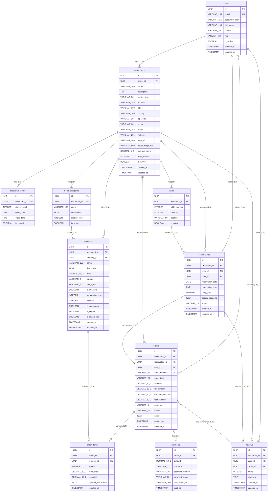

# Modelo de Base de Datos - Sistema de Restaurantes

## 1. Visión General

Este documento define el esquema relacional para el backend de un sistema de gestión de restaurantes. El modelo soporta múltiples restaurantes, gestión de menús, pedidos, reservas y usuarios con roles diferenciados.

---

## 2. Entidades

### 2.1. Entidad: `users`

| Columna | Tipo | Descripción |
|---------|------|-------------|
| id | `UUID` | Identificador único del usuario |
| email | `VARCHAR(255)` | Email único (autenticación) |
| password_hash | `VARCHAR(255)` | Hash de contraseña (bcrypt) |
| full_name | `VARCHAR(100)` | Nombre completo del usuario |
| phone | `VARCHAR(20)` | Teléfono de contacto |
| role | `VARCHAR(20)` | Rol del usuario |
| is_active | `BOOLEAN` | Estado de la cuenta |
| created_at | `TIMESTAMP` | Fecha de creación |
| updated_at | `TIMESTAMP` | Última actualización |

**Roles válidos:** `ADMIN`, `RESTAURANT_OWNER`, `STAFF`, `CUSTOMER`

---

### 2.2. Entidad: `restaurants`

| Columna | Tipo | Descripción |
|---------|------|-------------|
| id | `UUID` | Identificador único del restaurante |
| owner_id | `UUID` | ID del propietario (FK → users) |
| name | `VARCHAR(100)` | Nombre del restaurante |
| description | `TEXT` | Descripción del establecimiento |
| cuisine_type | `VARCHAR(50)` | Tipo de cocina |
| address | `VARCHAR(255)` | Dirección física |
| city | `VARCHAR(100)` | Ciudad |
 country | `VARCHAR(100)` | País |
| zip_code | `VARCHAR(20)` | Código postal |
| phone | `VARCHAR(20)` | Teléfono del restaurante |
| email | `VARCHAR(255)` | Email de contacto |
| website | `VARCHAR(255)` | Sitio web |
| logo_url | `VARCHAR(500)` | URL del logo |
| cover_image_url | `VARCHAR(500)` | URL de imagen portada |
| average_rating | `DECIMAL(3,2)` | Promedio de calificaciones |
| total_reviews | `INTEGER` | Total de reseñas |
| is_active | `BOOLEAN` | Estado del restaurante |
| created_at | `TIMESTAMP` | Fecha de creación |
| updated_at | `TIMESTAMP` | Última actualización |

---

### 2.3. Entidad: `restaurant_hours`

| Columna | Tipo | Descripción |
|---------|------|-------------|
| id | `UUID` | Identificador único |
| restaurant_id | `UUID` | ID del restaurante (FK) |
| day_of_week | `INTEGER` | Día de la semana (0=Dom, 6=Sáb) |
| open_time | `TIME` | Hora de apertura |
| close_time | `TIME` | Hora de cierre |
| is_closed | `BOOLEAN` | Si está cerrado ese día |

---

### 2.4. Entidad: `tables`

| Columna | Tipo | Descripción |
|---------|------|-------------|
| id | `UUID` | Identificador único |
| restaurant_id | `UUID` | ID del restaurante (FK) |
| table_number | `INTEGER` | Número de mesa |
| capacity | `INTEGER` | Capacidad de personas |
| location | `VARCHAR(50)` | Ubicación (ej: Interior, Terraza) |
| is_active | `BOOLEAN` | Estado de la mesa |

---

### 2.5. Entidad: `menu_categories`

| Columna | Tipo | Descripción |
|---------|------|-------------|
| id | `UUID` | Identificador único |
| restaurant_id | `UUID` | ID del restaurante (FK) |
| name | `VARCHAR(100)` | Nombre de la categoría |
| description | `TEXT` | Descripción de la categoría |
| display_order | `INTEGER` | Orden de visualización |
| is_active | `BOOLEAN` | Estado de la categoría |

---

### 2.6. Entidad: `products`

| Columna | Tipo | Descripción |
|---------|------|-------------|
| id | `UUID` | Identificador único |
| restaurant_id | `UUID` | ID del restaurante (FK) |
| category_id | `UUID` | ID de categoría (FK) |
| name | `VARCHAR(100)` | Nombre del producto |
| description | `TEXT` | Descripción del producto |
| price | `DECIMAL(10,2)` | Precio unitario |
| currency | `VARCHAR(3)` | Moneda (default: USD) |
| image_url | `VARCHAR(500)` | URL de imagen |
| is_available | `BOOLEAN` | Disponibilidad |
| preparation_time | `INTEGER` | Tiempo prep. (minutos) |
| calories | `INTEGER` | Calorías (opcional) |
| is_vegetarian | `BOOLEAN` | Indicador vegetariano |
| is_vegan | `BOOLEAN` | Indicador vegano |
| is_gluten_free | `BOOLEAN` | Sin gluten |
| created_at | `TIMESTAMP` | Fecha de creación |
| updated_at | `TIMESTAMP` | Última actualización |

---

### 2.7. Entidad: `reservations`

| Columna | Tipo | Descripción |
|---------|------|-------------|
| id | `UUID` | Identificador único |
| restaurant_id | `UUID` | ID del restaurante (FK) |
| user_id | `UUID` | ID del usuario cliente (FK) |
| table_id | `UUID` | ID de la mesa (FK) |
| reservation_date | `DATE` | Fecha de reserva |
| reservation_time | `TIME` | Hora de reserva |
| party_size | `INTEGER` | Número de personas |
| special_requests | `TEXT` | Solicitudes especiales |
| status | `VARCHAR(20)` | Estado de la reserva |
| created_at | `TIMESTAMP` | Fecha de creación |
| updated_at | `TIMESTAMP` | Última actualización |

**Estados válidos:** `PENDING`, `CONFIRMED`, `SEATED`, `CANCELLED`, `NO_SHOW`

---

### 2.8. Entidad: `orders`

| Columna | Tipo | Descripción |
|---------|------|-------------|
| id | `UUID` | Identificador único |
| restaurant_id | `UUID` | ID del restaurante (FK) |
| reservation_id | `UUID` | ID de reserva (FK, nullable) |
| user_id | `UUID` | ID del usuario cliente (FK) |
| order_number | `VARCHAR(20)` | Número de orden único |
| order_type | `VARCHAR(20)` | Tipo de orden |
| subtotal | `DECIMAL(10,2)` | Subtotal |
| tax_amount | `DECIMAL(10,2)` | Monto de impuestos |
| discount_amount | `DECIMAL(10,2)` | Monto de descuento |
| total_amount | `DECIMAL(10,2)` | Total final |
| currency | `VARCHAR(3)` | Moneda |
| status | `VARCHAR(20)` | Estado de la orden |
| notes | `TEXT` | Notas adicionales |
| created_at | `TIMESTAMP` | Fecha de creación |
| updated_at | `TIMESTAMP` | Última actualización |

**Tipos válidos:** `DINE_IN`, `TAKEOUT`, `DELIVERY`

**Estados válidos:** `PENDING`, `CONFIRMED`, `PREPARING`, `READY`, `SERVED`, `CANCELLED`

---

### 2.9. Entidad: `order_items`

| Columna | Tipo | Descripción |
|---------|------|-------------|
| id | `UUID` | Identificador único |
| order_id | `UUID` | ID de la orden (FK) |
| product_id | `UUID` | ID del producto (FK) |
| quantity | `INTEGER` | Cantidad |
| unit_price | `DECIMAL(10,2)` | Precio unitario (snapshot) |
| subtotal | `DECIMAL(10,2)` | Subtotal del ítem |
| special_instructions | `TEXT` | Instrucciones especiales |
| created_at | `TIMESTAMP` | Fecha de creación |

---

### 2.10. Entidad: `payments`

| Columna | Tipo | Descripción |
|---------|------|-------------|
| id | `UUID` | Identificador único |
| order_id | `UUID` | ID de la orden (FK) |
| amount | `DECIMAL(10,2)` | Monto pagado |
| currency | `VARCHAR(3)` | Moneda |
| payment_method | `VARCHAR(30)` | Método de pago |
| payment_status | `VARCHAR(20)` | Estado del pago |
| transaction_id | `VARCHAR(100)` | ID de transacción externo |
| paid_at | `TIMESTAMP` | Fecha del pago |

**Métodos de pago:** `CASH`, `CREDIT_CARD`, `DEBIT_CARD`, `DIGITAL_WALLET`, `BANK_TRANSFER`

**Estados:** `PENDING`, `COMPLETED`, `FAILED`, `REFUNDED`

---

### 2.11. Entidad: `reviews`

| Columna | Tipo | Descripción |
|---------|------|-------------|
| id | `UUID` | Identificador único |
| restaurant_id | `UUID` | ID del restaurante (FK) |
| user_id | `UUID` | ID del usuario (FK) |
| order_id | `UUID` | ID de la orden (FK, nullable) |
| rating | `INTEGER` | Calificación (1-5) |
| comment | `TEXT` | Comentario de la reseña |
| created_at | `TIMESTAMP` | Fecha de creación |
| updated_at | `TIMESTAMP` | Última actualización |

---

## 3. Claves Primarias y Foráneas

### 3.1. Claves Primarias (PK)

| Tabla | Columna |
|-------|---------|
| users | `id` |
| restaurants | `id` |
| restaurant_hours | `id` |
| tables | `id` |
| menu_categories | `id` |
| products | `id` |
| reservations | `id` |
| orders | `id` |
| order_items | `id` |
| payments | `id` |
| reviews | `id` |

Todas las claves primarias son de tipo `UUID` para garantizar unicidad global y facilitar la replicación.

---

### 3.2. Claves Foráneas (FK)

| Tabla | Columna FK | Tabla Referenciada | Columna Referenciada |
|-------|-----------|-------------------|---------------------|
| restaurants | `owner_id` | users | id |
| restaurant_hours | `restaurant_id` | restaurants | id |
| tables | `restaurant_id` | restaurants | id |
| menu_categories | `restaurant_id` | restaurants | id |
| products | `restaurant_id` | restaurants | id |
| products | `category_id` | menu_categories | id |
| reservations | `restaurant_id` | restaurants | id |
| reservations | `user_id` | users | id |
| reservations | `table_id` | tables | id |
| orders | `restaurant_id` | restaurants | id |
| orders | `reservation_id` | reservations | id |
| orders | `user_id` | users | id |
| order_items | `order_id` | orders | id |
| order_items | `product_id` | products | id |
| payments | `order_id` | orders | id |
| reviews | `restaurant_id` | restaurants | id |
| reviews | `user_id` | users | id |
| reviews | `order_id` | orders | id |

---

## 4. Restricciones

### 4.1. Restricciones de Unicidad (UNIQUE)

| Tabla | Columnas |
|-------|----------|
| users | `email` |
| restaurants | `(owner_id, name)` |
| tables | `(restaurant_id, table_number)` |
| orders | `order_number` |

---

### 4.2. Restricciones de No Nulo (NOT NULL)

| Tabla | Columnas Obligatorias |
|-------|----------------------|
| users | `email`, `password_hash`, `full_name`, `role` |
| restaurants | `owner_id`, `name`, `address`, `city`, `country` |
| restaurant_hours | `restaurant_id`, `day_of_week` |
| tables | `restaurant_id`, `table_number`, `capacity` |
| menu_categories | `restaurant_id`, `name` |
| products | `restaurant_id`, `category_id`, `name`, `price` |
| reservations | `restaurant_id`, `user_id`, `table_number`, `reservation_date`, `reservation_time`, `party_size` |
| orders | `restaurant_id`, `user_id`, `order_number`, `order_type`, `total_amount` |
| order_items | `order_id`, `product_id`, `quantity`, `unit_price` |
| payments | `order_id`, `amount`, `payment_method` |
| reviews | `restaurant_id`, `user_id`, `rating` |

---

### 4.3. Restricciones de Check (CHECK)

| Tabla | Restricción |
|-------|-------------|
| restaurant_hours | `day_of_week BETWEEN 0 AND 6` |
| tables | `capacity > 0` |
| products | `price > 0`, `preparation_time > 0` |
| reservations | `party_size > 0`, `rating BETWEEN 1 AND 5` |
| reviews | `rating BETWEEN 1 AND 5` |
| order_items | `quantity > 0` |
| payments | `amount > 0` |
| restaurants | `average_rating BETWEEN 0 AND 5` |

---

### 4.4. Restricciones de Valor por Defecto (DEFAULT)

| Tabla | Columna | Valor Default |
|-------|---------|--------------|
| users | `is_active` | `true` |
| products | `currency` | `'USD'` |
| products | `is_available` | `true` |
| products | `is_vegetarian` | `false` |
| products | `is_vegan` | `false` |
| products | `is_gluten_free` | `false` |
| tables | `is_active` | `true` |
| menu_categories | `is_active` | `true` |
| restaurants | `is_active` | `true` |
| restaurants | `average_rating` | `0` |
| restaurants | `total_reviews` | `0` |

---

### 4.5. Restricciones de Referencia (ON DELETE/UPDATE)

| Tabla | FK | Acción ON DELETE | Acción ON UPDATE |
|-------|-------|------------------|------------------|
| restaurants | `owner_id` | RESTRICT | CASCADE |
| restaurant_hours | `restaurant_id` | CASCADE | CASCADE |
| tables | `restaurant_id` | CASCADE | CASCADE |
| menu_categories | `restaurant_id` | CASCADE | CASCADE |
| products | `restaurant_id` | CASCADE | CASCADE |
| products | `category_id` | RESTRICT | CASCADE |
| reservations | `restaurant_id` | CASCADE | CASCADE |
| reservations | `user_id` | RESTRICT | CASCADE |
| reservations | `table_id` | RESTRICT | CASCADE |
| orders | `restaurant_id` | CASCADE | CASCADE |
| orders | `reservation_id` | SET NULL | CASCADE |
| orders | `user_id` | RESTRICT | CASCADE |
| order_items | `order_id` | CASCADE | CASCADE |
| order_items | `product_id` | RESTRICT | CASCADE |
| payments | `order_id` | CASCADE | CASCADE |
| reviews | `restaurant_id` | CASCADE | CASCADE |
| reviews | `user_id` | CASCADE | CASCADE |
| reviews | `order_id` | SET NULL | CASCADE |

---

## 5. Relaciones

### 5.1. Relación: Users ↔ Restaurants

| Tipo | Descripción |
|------|-------------|
| 1:N | Un usuario (owner) puede tener múltiples restaurantes |
| Cardinalidad | Users (1) → (N) Restaurants |

---

### 5.2. Relación: Restaurants ↔ Restaurant Hours

| Tipo | Descripción |
|------|-------------|
| 1:N | Un restaurante tiene múltiples registros de horarios (uno por día) |
| Cardinalidad | Restaurants (1) → (N) Restaurant Hours |

---

### 5.3. Relación: Restaurants ↔ Tables

| Tipo | Descripción |
|------|-------------|
| 1:N | Un restaurante tiene múltiples mesas |
| Cardinalidad | Restaurants (1) → (N) Tables |

---

### 5.4. Relación: Restaurants ↔ Menu Categories

| Tipo | Descripción |
|------|-------------|
| 1:N | Un restaurante tiene múltiples categorías de menú |
| Cardinalidad | Restaurants (1) → (N) Menu Categories |

---

### 5.5. Relación: Menu Categories ↔ Products

| Tipo | Descripción |
|------|-------------|
| 1:N | Una categoría contiene múltiples productos |
| Cardinalidad | Menu Categories (1) → (N) Products |

---

### 5.6. Relación: Restaurants ↔ Products

| Tipo | Descripción |
|------|-------------|
| 1:N | Un restaurante ofrece múltiples productos |
| Cardinalidad | Restaurants (1) → (N) Products |

---

### 5.7. Relación: Users ↔ Reservations

| Tipo | Descripción |
|------|-------------|
| 1:N | Un usuario puede hacer múltiples reservas |
| Cardinalidad | Users (1) → (N) Reservations |

---

### 5.8. Relación: Restaurants ↔ Reservations

| Tipo | Descripción |
|------|-------------|
| 1:N | Un restaurante recibe múltiples reservas |
| Cardinalidad | Restaurants (1) → (N) Reservations |

---

### 5.9. Relación: Tables ↔ Reservations

| Tipo | Descripción |
|------|-------------|
| 1:N | Una mesa puede tener múltiples reservas en diferentes fechas |
| Cardinalidad | Tables (1) → (N) Reservations |

---

### 5.10. Relación: Users ↔ Orders

| Tipo | Descripción |
|------|-------------|
| 1:N | Un usuario puede realizar múltiples pedidos |
| Cardinalidad | Users (1) → (N) Orders |

---

### 5.11. Relación: Restaurants ↔ Orders

| Tipo | Descripción |
|------|-------------|
| 1:N | Un restaurante recibe múltiples pedidos |
| Cardinalidad | Restaurants (1) → (N) Orders |

---

### 5.12. Relación: Reservations ↔ Orders

| Tipo | Descripción |
|------|-------------|
| 1:1 | Una orden puede estar asociada opcionalmente a una reserva |
| Cardinalidad | Reservations (1) → (0..1) Orders |

---

### 5.13. Relación: Orders ↔ Order Items

| Tipo | Descripción |
|------|-------------|
| 1:N | Una orden contiene múltiples ítems |
| Cardinalidad | Orders (1) → (N) Order Items |

---

### 5.14. Relación: Products ↔ Order Items

| Tipo | Descripción |
|------|-------------|
| 1:N | Un producto puede aparecer en múltiples ítems de orden |
| Cardinalidad | Products (1) → (N) Order Items |

---

### 5.15. Relación: Orders ↔ Payments

| Tipo | Descripción |
|------|-------------|
| 1:N | Una orden puede tener múltiples pagos (parciales) |
| Cardinalidad | Orders (1) → (N) Payments |

---

### 5.16. Relación: Users ↔ Reviews

| Tipo | Descripción |
|------|-------------|
| 1:N | Un usuario puede escribir múltiples reseñas |
| Cardinalidad | Users (1) → (N) Reviews |

---

### 5.17. Relación: Restaurants ↔ Reviews

| Tipo | Descripción |
|------|-------------|
| 1:N | Un restaurante recibe múltiples reseñas |
| Cardinalidad | Restaurants (1) → (N) Reviews |

---

### 5.18. Relación: Orders ↔ Reviews

| Tipo | Descripción |
|------|-------------|
| 1:1 | Una reseña puede estar asociada opcionalmente a una orden |
| Cardinalidad | Orders (1) → (0..1) Reviews |

---

## 6. Diagrama Entidad-Relación (Mermaid)

---

## 7. Índices Recomendados

| Tabla | Columnas | Tipo | Propósito |
|-------|----------|------|-----------|
| users | `email` | B-Tree | Login rápido |
| users | `role`, `is_active` | B-Tree | Filtrado por rol |
| restaurants | `owner_id`, `is_active` | B-Tree | Restaurantes de un owner |
| restaurants | `city`, `is_active` | B-Tree | Búsqueda por ciudad |
| tables | `restaurant_id`, `table_number` | B-Tree | Búsqueda única |
| products | `restaurant_id`, `category_id`, `is_available` | B-Tree | Menú filtrado |
| products | `name` | GIN | Búsqueda de texto completo |
| reservations | `restaurant_id`, `reservation_date` | B-Tree | Disponibilidad de fechas |
| reservations | `table_id`, `reservation_date` | B-Tree | Ocupación de mesas |
| orders | `user_id`, `created_at` | B-Tree | Historial de usuario |
| orders | `restaurant_id`, `status`, `created_at` | B-Tree | Pedidos activos |
| order_items | `order_id` | B-Tree | Detalles de orden |
| order_items | `product_id` | B-Tree | Estadísticas de producto |
| reviews | `restaurant_id`, `rating` | B-Tree | Ranking |
| reviews | `user_id` | B-Tree | Reseñas por usuario |

---

## 8. Consideraciones Adicionales

### 8.1. Normalización

El esquema está normalizado hasta la **Tercera Forma Normal (3NF)**:
- No existen atributos multivaluados
- Todas las dependencias funcionales no claves son triviales
- No hay dependencias transitivas de atributos no clave

### 8.2. Datos de Auditoría

Todas las tablas principales incluyen:
- `created_at`: Timestamp de creación (automático)
- `updated_at`: Timestamp de última modificación (automático)

### 8.3. Extensiones Futuras

El modelo permite extenderse con:
- Sistema de promociones y descuentos
- Múltiples métodos de pago integrados
- Gestión de inventario de ingredientes
- Análisis y reporting avanzado
- Integración con servicios de delivery externos
- Sistema de lealtad y puntos

---

## 9. Convenciones de Nomenclatura

| Elemento | Convención | Ejemplo |
|-----------|-----------|---------|
| Tablas | plural, snake_case | `menu_categories` |
| Columnas PK | `id` | `id` |
| Columnas FK | `{tabla}_id` | `restaurant_id` |
| Columnas timestamp | `{verbo}_at` | `created_at` |
| Columnas boolean | `is_{adjetivo}` | `is_active` |
| Enumeraciones | UPPER_CASE | `PENDING`, `CONFIRMED` |

---

*Documento versión 1.0 - Última actualización: 2026-03-18*
